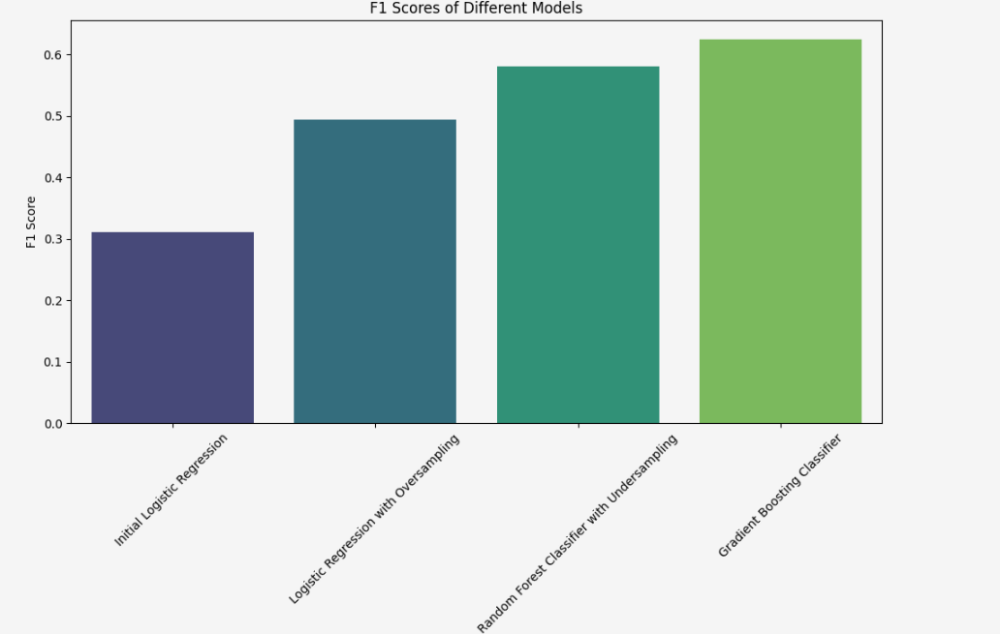
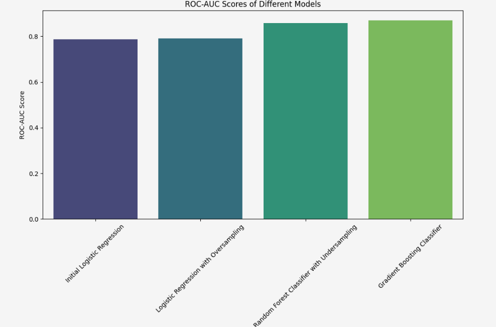

# Beta Bank Customers: Predicting Customer Churn with Maximum F1 Score

This project focuses on predicting customer churn for Beta Bank using various classification models, aiming to maximize the **F1 score** for balanced performance.

---

## 🧩 Problem

Churn prediction helps banks retain customers by identifying those likely to leave. The goal is to build a reliable machine learning model that detects churners with high accuracy and F1 score.

---

## 🛠️ Tools & Technologies

- Python (pandas, NumPy)
- scikit-learn
- matplotlib, seaborn
- Jupyter Notebook

---

## 🔄 Process Overview

1. **Data Preprocessing**
   - Handled missing values and encoded categorical features.
2. **EDA**
   - Analyzed customer behaviors and features.
3. **Model Training**
   - Logistic Regression
   - Logistic Regression with Oversampling
   - Random Forest with Undersampling
   - Gradient Boosting
4. **Evaluation**
   - F1 Score
   - ROC-AUC Score

---

## 📈 Results

- **Best Model**: Gradient Boosting Classifier
- **Top Metrics**:
  - F1 Score ≈ 0.63
  - ROC-AUC ≈ 0.87

---

## 📊 Visualizations

**F1 Scores of Different Models**  

**ROC-AUC Scores of Different Models**  

---

## 📁 Files

- `Beta_bank_churn.ipynb` – Main notebook
- `images/` – Contains performance visualizations
- `README.md` – Project overview

---

## ✅ Conclusion

The Gradient Boosting Classifier yielded the highest F1 and ROC-AUC scores, making it the most effective model for identifying churners. This solution can significantly aid Beta Bank in proactive customer retention strategies and improving business decisions.

