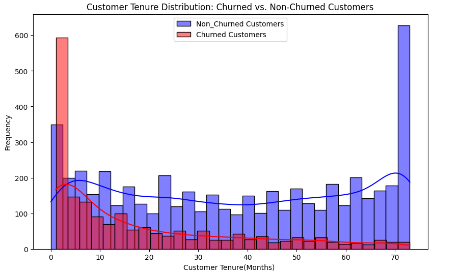
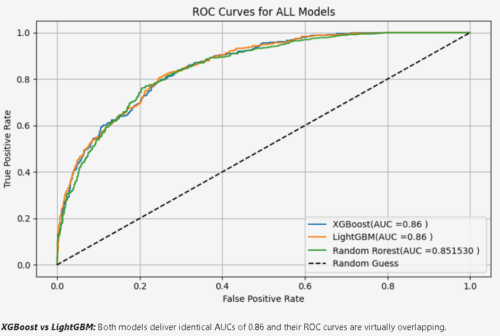

# 📉 Customer Churn Prediction

This project predicts whether a customer is likely to churn using classification models. The goal is to help telecom businesses retain customers and reduce revenue loss.

---

## 🧩 Problem

Telecom companies lose revenue when customers churn. We aim to build a predictive model to anticipate this behavior and help retain at-risk customers.

---

## 🛠️ Tools & Technologies

- Python, pandas, NumPy  
- scikit-learn, XGBoost, LightGBM  
- matplotlib, seaborn  

---

## 🔁 Process Overview

1. **Data Cleaning** – Removed missing values and outliers  
2. **EDA** – Explored tenure, contract types, charges, churn rates  
3. **Feature Engineering** – Built new variables like service usage flags  
4. **Modeling** – Logistic Regression, Random Forest, XGBoost, LightGBM  
5. **Evaluation** – Accuracy, ROC-AUC

---

## 📊 Results

- **Best Model:** Random Forest (Accuracy ≈ 85%)  
- **Top Features:** Contract type, tenure, monthly charges  

---

## 📁 Files

- `churn_model.ipynb` – Main analysis notebook  
- `data/` – Cleaned dataset  

---

## 📊 Visualizations

**Churn Distribution**  

**ROC Curve**  

---

## ✅ Conclusion

The model can effectively predict customers at risk of churn. The project highlights key features influencing churn, which can guide retention strategies.

