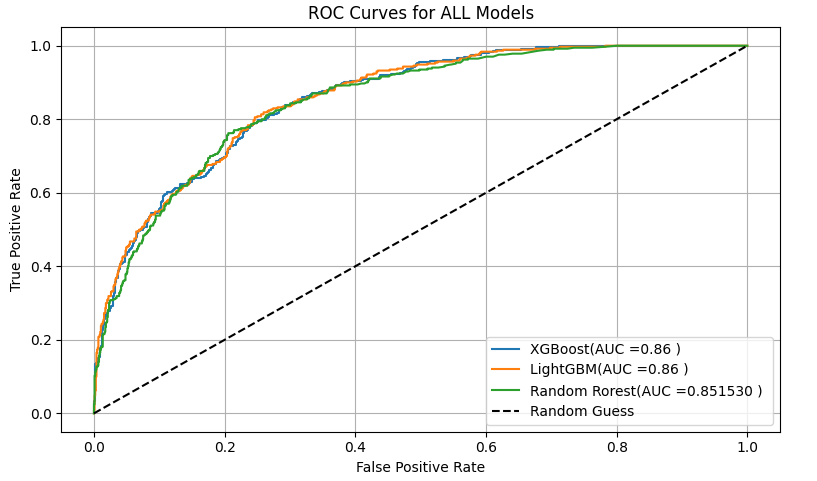

# Customer Churn Prediction

This project predicts whether a customer is likely to churn using classification models. The goal is to help businesses retain customers and reduce loss.

## 🧩 Problem

Telecom companies lose revenue when customers churn. We want to build a predictive model to anticipate this behavior.

## 🛠️ Tools & Technologies

- Python, pandas, NumPy  
- scikit-learn  
- matplotlib, seaborn

## 🔄 Process Overview

1. **Data Cleaning** – Handled missing values and outliers  
2. **EDA** – Explored trends and relationships in churn behavior  
3. **Feature Engineering** – Built new variables to improve model accuracy  
4. **Modeling** – Logistic Regression, Random Forest  
5. **Evaluation** – Accuracy, ROC-AUC

## 📈 Results

- Best Model: Random Forest (Accuracy ~85%)  
- Important Features: Contract type, Tenure, Monthly Charges

## 📁 Files

- `churn_model.ipynb` – Main analysis notebook  
- `data/` – Cleaned data
## 📊 Visuals

### Customer Tenure Distribution

### ROC Curve for All Models

