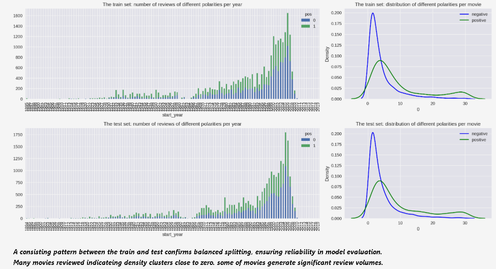

# IMDB Sentiment Classification

This project aims to classify movie reviews from the IMDB dataset into **positive** or **negative** sentiments using natural language processing (NLP) techniques and machine learning models.

---

## 🧩 Problem Statement

Movie reviews often influence audience behavior. Automating sentiment classification helps media platforms and producers quickly understand audience feedback.

---

## 🛠️ Tools & Technologies

- Python
- pandas, NumPy
- scikit-learn
- TF-IDF Vectorizer
- Matplotlib, Seaborn

---

## 🔄 Process Overview

1. **Data Preparation**
   - Loaded and cleaned review dataset.
   - Split into train and test with balanced classes.

2. **Text Vectorization**
   - Applied TF-IDF to convert text into feature vectors.

3. **Model Training**
   - Trained Logistic Regression, Random Forest.
   - Evaluated with F1 Score, ROC AUC, PRC.

4. **Validation**
   - Used precision-recall curve and ROC to verify consistency.

---

## 📊 Visualizations

### 1. Distribution of Review Counts and Densities

> A consistent pattern between the train and test confirms balanced splitting, ensuring reliability in model evaluation.  
> Many movies reviewed indicate density clusters close to zero; some generate significant review volumes.

---

### 2. Model Evaluation Curves

> **Test Accuracy**: 0.86  
> **Test F1 Score**: 0.87 (strong balance of precision and recall)  
> **TF-IDF** vectorization proved effective.

---

## ✅ Conclusion

- The Logistic Regression model using TF-IDF features effectively classifies sentiment.
- Balanced data and clear density distribution contribute to model stability.
- The pipeline can be adapted for other sentiment or text classification tasks.

---

## 📁 Files

- `Sentiment_analysis.ipynb` – Full notebook
- `images/` – All visual outputs used in the notebook

---

