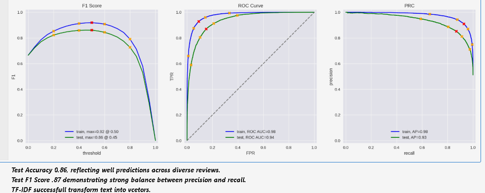

# IMDB Sentiment Classification

This project explores sentiment analysis on IMDB movie reviews using text preprocessing and machine learning models. The primary goal was to accurately classify reviews as positive or negative based on their content.

---

## 📌 Objective

Classify IMDB reviews into **positive** or **negative** sentiments using natural language processing (NLP) techniques and evaluate multiple models to maximize F1 score.

---

## 📊 Dataset Overview

- Large corpus of IMDB reviews labeled as `positive` or `negative`.
- Reviews span multiple decades.
- Texts were preprocessed and vectorized using **TF-IDF**.

---

## 📊 Train-Test Split Distribution

_A consistent pattern between the train and test confirms balanced splitting, ensuring reliability in model evaluation. Many movies reviewed indicating density clusters close to zero. Some movies generate significant review volumes._

---

## 📈 Model Performance

_Test Accuracy 0.86, reflecting well predictions across diverse reviews.  
Test F1 Score 0.87 demonstrating strong balance between precision and recall.  
TF-IDF successfully transformed text into vectors.

---

## ⚙️ Tools Used

- Python
- Scikit-learn
- NLTK
- Matplotlib, Seaborn

---

## ✅ Results Summary

| Metric        | Train | Test |
|---------------|-------|------|
| F1 Score      | 0.92  | 0.87 |
| ROC AUC       | 0.98  | 0.94 |
| Precision-Recall AUC | 0.98 | 0.93 |

---

## 📚 Future Improvements

- Explore LSTM/BERT for deeper semantic understanding.
- Tune hyperparameters via GridSearchCV.
- Incorporate review length and metadata.

---

## 📁 File List

- `Sentiment_analysis.ipynb`: Main notebook
- `Train_test_split_distribution.png`: Data distribution plots
- `model_evaluation_curves.png`: Evaluation charts

---

## ✍️ Author

Lanin Chowdhury  
Data Science Portfolio Project
