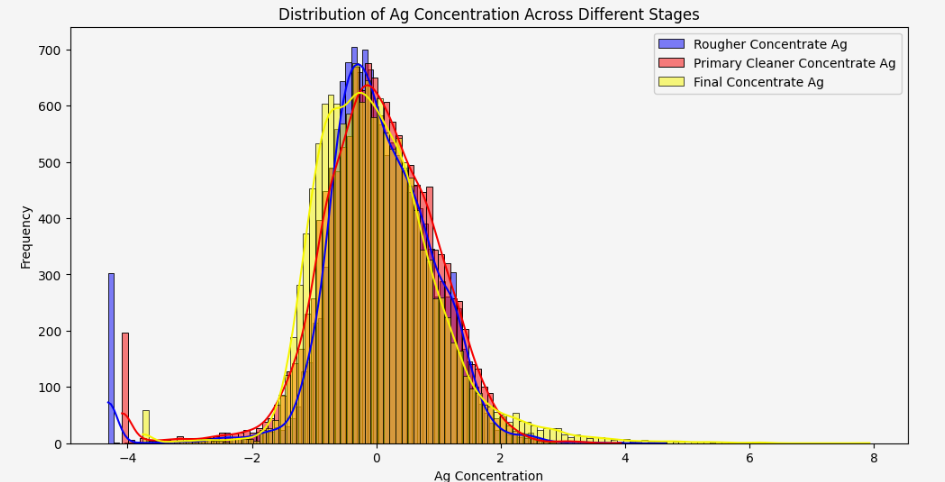
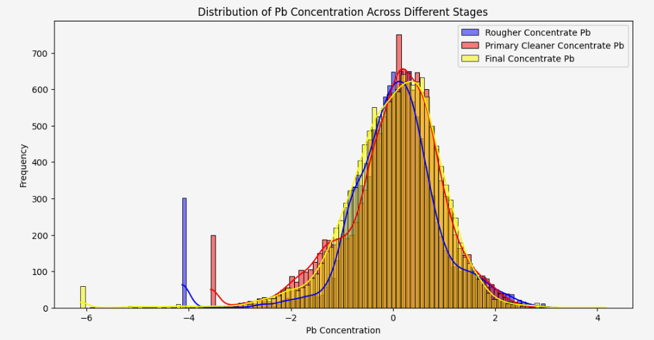

# Oil Well Profitability Prediction

This project analyzes and predicts the profitability of oil wells using machine learning based on physical and chemical parameters from the extraction process.

## 🧩 Problem

Oil companies need to determine which wells are most profitable to allocate resources efficiently. This project builds a model to predict product volume and select profitable locations.

## 🛠️ Tools & Technologies

- Python, pandas, NumPy
- scikit-learn
- Matplotlib, seaborn

## 🔄 Process Overview

1. **Data Cleaning** – Removed missing values and outliers  
2. **EDA** – Explored key features affecting product volume  
3. **Feature Engineering** – Normalized and transformed variables  
4. **Modeling** – Trained Linear Regression and Random Forest models  
5. **Evaluation** – Compared models using RMSE and profit simulation  
6. **Business Decision** – Used bootstrapping to simulate ROI

## 📈 Results

- The best-performing model: **Random Forest Regressor**
- Key insight: **Region B** yielded the highest average profit
- Business recommendation: Focus investment on top 200 wells in Region B

## 📁 Files

- `Integrated_Project.ipynb` – Main notebook
- `images/` – Contains charts and visual summaries

## 📊 Visualizations

### Distribution of Ag Concentration Across Stages  

### Distribution of Pb Concentration Across Stages  

## ✅ Conclusion

The model effectively identifies which wells are likely to be profitable. By simulating investment scenarios, we found that **Region B** consistently delivered higher returns. This tool can assist decision-makers in prioritizing oil field investments and maximizing ROI.
