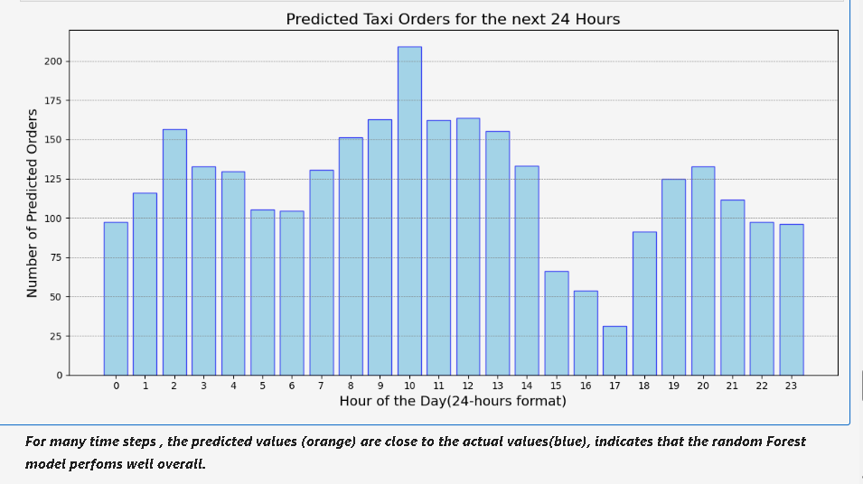
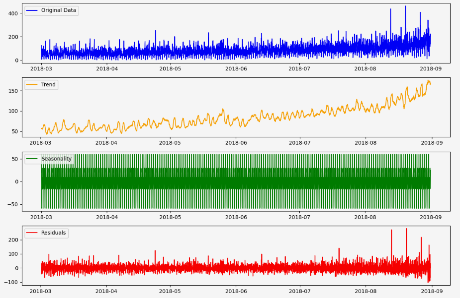

# Taxi Demand Forecasting

This project forecasts taxi ride demand using time series data to help improve fleet allocation and reduce customer wait times.

## 🎯 Problem

Taxi companies face fluctuating demand. Predicting when and where rides are needed helps maximize profits and customer satisfaction.

## 🛠️ Tools & Technologies

- Python, pandas, matplotlib  
- statsmodels, scikit-learn  
- Time Series Analysis (Decomposition, Autocorrelation)

## 🔄 Process Overview

1. **Data Preprocessing** – Cleaned and formatted datetime values  
2. **EDA** – Identified seasonal trends and demand spikes  
3. **Feature Engineering** – Created time-based features (hour, day, etc.)  
4. **Modeling** – Used SARIMA and Random Forest  
5. **Evaluation** – Compared RMSE across models

## 📈 Results

- SARIMA model captured seasonality well  
- Forecasts helped predict peak demand hours  
- Business insight: Ride demand spikes during weekends and evenings

## 📁 Files

- `taxi_forecasting.ipynb` – Main notebook  
- `data/` – Raw and processed time series data

## 📊 Visuals

### Hourly Forecasted Taxi Demand  

### Time Series Decomposition (Trend, Seasonality, Residuals)  

