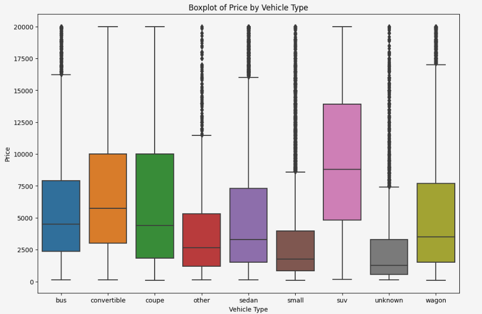
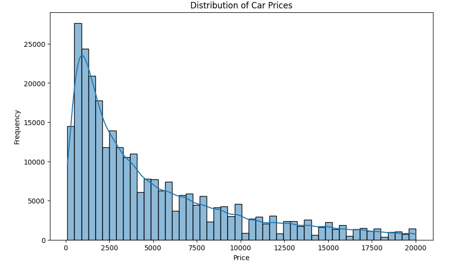

# Used Car Price Prediction

This project predicts the price of a used car based on various features using regression models.

## 🧩 Problem
Buying or selling used cars is tricky without knowing fair prices. This project aims to build a model that predicts car prices accurately.

## 🛠️ Tools & Technologies
- Python, pandas, NumPy
- scikit-learn
- matplotlib, seaborn

## 🔄 Process Overview
- **Data Cleaning** – Removed nulls, corrected types
- **EDA** – Analyzed features affecting price
- **Modeling** – Linear Regression, Random Forest, XGBoost
- **Evaluation** – RMSE, R² Score

## 📈 Results
- **Best Model**: Random Forest
- **Top Predictors**: Car age, mileage, brand

## 📁 Files
- `Used_Car_Price.ipynb` – Main notebook
- `images/` – Visual charts

### 📊 Visualizations

#### Boxplot of Price by Vehicle Type

#### Distribution of Car Prices

## 🧾 Conclusion

The project successfully built a regression model to predict used car prices based on features such as age, mileage, and brand. Random Forest emerged as the best-performing model, offering the lowest RMSE and the highest R² score. The insights gained from the data—like price trends by car type and the importance of age/mileage—can help sellers price their vehicles more competitively and assist buyers in evaluating fair market values. This model can be further improved with more granular data or real-time pricing feeds.
